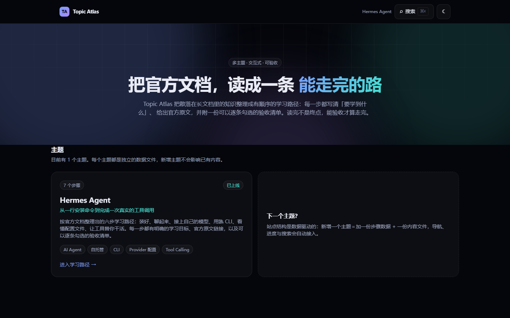
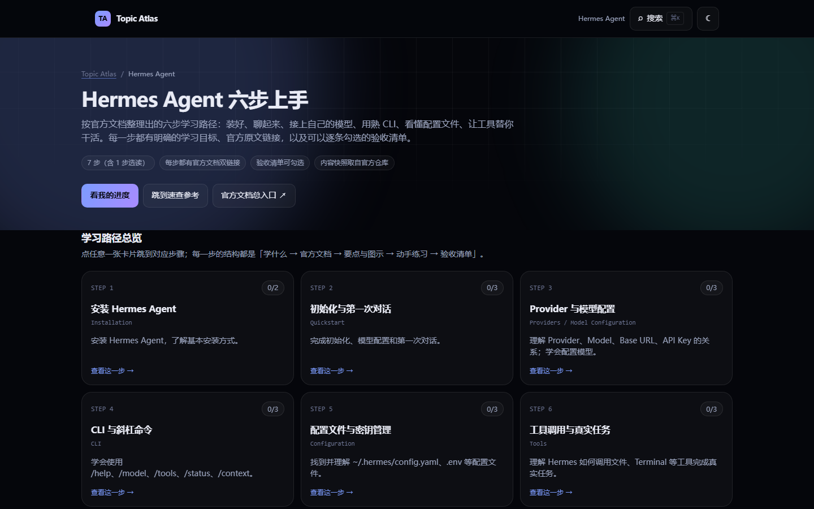

# Topic Atlas

把官方文档整理成**有学习目标、有官方出处、有可勾选验收清单**的交互式学习路径站。第一个主题是 [Hermes Agent](https://hermes-agent.nousresearch.com/)（Nous Research 出品的自托管 AI Agent）。

**线上地址：[https://topicatlas.tech](https://topicatlas.tech)**（绑定自定义域名 + 强制 HTTPS）

[](https://github.com/fategao/topicatlas/actions/workflows/deploy.yml)
[](LICENSE)
[](tests)





站点是纯静态页面：无后端、无账号、无 Cookie 追踪；学习进度只保存在访问者自己的浏览器里。

## 站点结构

- `/` — 主题列表。数据结构驱动，新增主题只需补一份数据 + 一份内容。
- `/hermes` — Hermes Agent 学习路径主页面：
  - 6 个主步骤 + 1 个选读步骤（Installation / Quickstart / Providers / CLI / Configuration / Tools / Learning Path）
  - 每步结构固定：**学什么 → 官方中英双链接 → 要点与图示 → 动手练习 → 验收清单**
  - 底部是四个交互式速查参考：CLI 命令、配置项、工具集、Provider
  - 全局 ⌘K / Ctrl+K 搜索，可检索步骤、命令、配置项、工具集与 provider

进度以 `topicatlas:progress:hermes:v1` 为键写入 `localStorage`；某一步的验收项全部勾选后该步才标记完成，并提供一键重置。

## 技术栈

| 层 | 选型 |
|---|---|
| 构建 | Vite 7 + React 19 + TypeScript |
| 样式 | Tailwind CSS v4（`@theme inline` + 语义化 CSS 变量，`data-theme` 切换深浅色） |
| 内容 | MDX（构建时编译）+ 结构化 JSON（由内容管线生成） |
| 代码高亮 | Shiki（构建时高亮，零运行时开销） |
| 动效 | CSS + IntersectionObserver 滚动显现，全部尊重 `prefers-reduced-motion` |
| 测试 | Vitest + Testing Library（单元/组件）+ Playwright（E2E，桌面与移动双视口） |
| 部署 | GitHub Actions → GitHub Pages，自定义域名经 Cloudflare |

## 本地开发

```bash
npm install
npm run dev        # 开发服务器（热更新），http://localhost:5173
npm start          # 一条命令：构建 + 起本地服务 + 自动打开浏览器 ← 只想看效果用这个
npm run build      # tsc -b + vite build + SPA 404 回退
npm run start:dist # 只起本地服务（不重新构建），http://127.0.0.1:4173
```

> ⚠️ **不要直接双击 `dist/index.html`**。构建产物引用的是站点根路径（`/assets/...`），在 `file://` 协议下浏览器会把它解析成磁盘根目录（`D:/assets/...`）并因 CORS 拦截，结果是**整页白屏**。必须通过 http 打开：`npm start` 或 `npm run start:dist` 均可（`scripts/serve.mjs` 是零依赖本地服务器，并完整还原了 GitHub Pages 的 404 回退行为）。

## 内容管线

站点内容不是手抄的，而是从官方仓库抓取快照后结构化生成的。三段式脚本：

```bash
npm run content:fetch      # 1. 抓取官方中英文 Markdown 快照 → content/upstream/
npm run content:extract    # 2. 抽取结构化数据 → src/data/hermes/*.json
npm run content:validate   # 3. 校验内容完整性（CI 也会跑）
npm run content:refresh    # 等价于依次执行上面三步
```

- **抓取**走 `api.github.com` 的 contents 接口（本机无法直连 `raw.githubusercontent.com`），拿到的是 `NousResearch/hermes-agent` 仓库里 `website/i18n/zh-Hans/` 的中文文档与 `website/docs/` 的英文文档。
- 每次抓取都会把上游 commit SHA、抓取时间、许可证写进 `content/upstream/manifest.json`，站点页脚会展示这些信息。
- **抽取**把官方文档拆成四份可交互数据：CLI 命令（含选项表与示例）、配置小节与配置键、工具集与工具、Provider 与鉴权方式。每条都带官方锚点，页面上可以点回原文核对。
- **校验**会检查：7 个步骤齐全、每步都有学习目标/双链接/验收清单、每条参考数据都指向官方域名、数据与快照的 commit 一致、正文里没有占位文本。

## 测试与校验

```bash
npm run typecheck    # tsc -b
npm run lint         # eslint
npm run test         # Vitest：纯逻辑 + 组件交互
npm run e2e          # Playwright：桌面 1440 + 移动 Pixel 7
```

E2E 覆盖：首页 → 学习路径 → 勾选验收 → 刷新后进度仍在、⌘K 全局搜索、速查参考切换与搜索、深浅色切换与持久化、深链直接访问 `/hermes`、移动端无横向溢出、`prefers-reduced-motion` 下依然可用。

## 部署

### 本仓库的实际部署（可作为参考）

| 环节 | 实际配置 |
|---|---|
| 域名 | `topicatlas.tech`，在**阿里云**注册（含实名认证，未认证会被 `client hold` 暂停解析） |
| DNS | 阿里云云解析：apex 4 条 A 记录指向 GitHub Pages（`185.199.108-111.153`），`www` CNAME 指向 `fategao.github.io` |
| 托管 | GitHub Pages，Source = **GitHub Actions**（`deploy.yml` 自动构建发布） |
| 自定义域名 | 在仓库 Settings → Pages → Custom domain 填 `topicatlas.tech`（**Actions 部署模式下，构建产物里的 CNAME 不会自动设置它，必须手填一次**） |
| HTTPS | 证书由 GitHub 自动签发（Let's Encrypt，覆盖 apex 与 www），随后勾上 **Enforce HTTPS**，`http://` 会 301 到 `https://` |
| 旧地址 | `fategao.github.io/topicatlas/` 会自动 301 到 `https://topicatlas.tech/` |

验证命令：`npm run deploy:check -- --url https://topicatlas.tech/`（检查仓库、站点、静态资源、深链状态码、http→https 跳转）。

### 0. 域名与部署路径只有一个配置源

根目录的 [`site.config.json`](site.config.json) 同时决定「绑哪个域名」和「跑在根路径还是子路径」，构建时自动生成 `CNAME`、`robots.txt`、`sitemap.xml`，并注入 `index.html` 的 canonical 与 og:url：

```json
{
  "domain": "topicatlas.dev",
  "customDomain": false,
  "basePath": "/topicatlas",
  "repo": "fategao/topicatlas"
}
```

| 字段 | 含义 |
|---|---|
| `domain` | 最终要绑定的域名（还没买也能先填着） |
| `customDomain` | `false` = 还没绑域名：**不产出 CNAME**，canonical/sitemap 指向 GitHub Pages 项目页；`true` = 产出 CNAME 并用自定义域名 |
| `basePath` | 部署在子路径时填 `/仓库名`；绑定自定义域名后改成 `""` |
| `repo` | 未绑域名时用来推导项目页地址 `https://<user>.github.io/<repo>/` |

> 这两个字段配错就是"页面打不开"的两大主因：`customDomain: true` 但域名没解析 → 项目页被 301 到死域名；`basePath` 与真实部署路径不一致 → 资源 404 整页白屏。

> 关于 `.dev` 的价格：`topicatlas.dev` 这类 `.dev` 域名的批发价本身就在 $10/年左右（约 ¥70），Cloudflare Registrar 是按成本价卖、且续费同价，所以它已经是地板价而不是加价。若想压低预算，可选的合规后缀有 `.link`（约 $7.7/年，平进平出）与 `.com`（约 $11/年）；要避开 `.site`、`.online` 这类“首年 ¥14、续费 ¥200+”的促销陷阱。换后缀只需改上面这一个配置文件。

### 1. 创建仓库并推送

```bash
git remote add origin https://github.com/haorangao972-ux/topicatlas.git
git push -u origin main
```

本机已通过代理（TUN 模式）可以直连 GitHub，直接 push 即可。若某天代理没开、需要临时指定代理，用单次命令（不写全局配置）：

```bash
git -c http.proxy=http://127.0.0.1:<端口> push -u origin main
```

### 2. 开启 GitHub Pages

仓库 **Settings → Pages → Build and deployment → Source** 选择 **GitHub Actions**。之后每次推送到 `main`，`.github/workflows/deploy.yml` 会自动校验内容、跑测试、构建并发布。

**还没买域名就先上线看效果？** 仓库里的 `site.config.json` 已经是这个形态（`customDomain: false` + `basePath: "/topicatlas"`），推上去就会正确跑在 `https://fategao.github.io/topicatlas/`。买好域名、DNS 配好后，把它改成 `customDomain: true`、`basePath: ""` 再推一次即可切换。

（CI 里也支持用仓库变量 `BASE_PATH` / `SITE_CUSTOM_DOMAIN` 临时覆盖同一组配置，用于多环境试跑。）

### 部署自检

```bash
npm run deploy:check
```

它会检查仓库是否存在、Pages 站点是否可访问，并专门诊断三种「部署绿了但页面打不开」：被 301 到未解析的自定义域名、资源路径与子路径不匹配（白屏）、静态资源 404。

### 一键切换部署形态

```bash
npm run domain:set topicatlas.tech   # 切到自定义域名（清空 basePath、产出 CNAME）
npm run domain:set --project-page    # 切回 GitHub Pages 项目页
```

脚本会改写 `site.config.json`，并打印需要添加的 DNS 记录（4 条 A + `www` CNAME）与后续步骤。**绑定自定义域名后要重新推送一次**，让 CI 发布带 CNAME 的新构建。

### 3. 配置自定义域名（Cloudflare）

1. 在 Cloudflare Registrar 注册 `topicatlas.dev`（若结账时该后缀不可选，可在 Porkbun / Spaceship 注册后把 NS 指向 Cloudflare）。
2. 在 Cloudflare DNS 添加 apex 记录（**先保持 DNS only / 灰云**）：

| 类型 | 名称 | 内容 |
|---|---|---|
| A | `@` | `185.199.108.153` |
| A | `@` | `185.199.109.153` |
| A | `@` | `185.199.110.153` |
| A | `@` | `185.199.111.153` |
| CNAME | `www` | `haorangao972-ux.github.io` |

3. 仓库 **Settings → Pages → Custom domain** 填 `topicatlas.dev` 并保存（`public/CNAME` 已随构建产物发布，这一步会直接通过校验）。
4. 等 GitHub 签发 Let's Encrypt 证书（Pages 页面会出现绿色 HTTPS 状态），然后勾选 **Enforce HTTPS**。
5. **证书签发成功之后**再把 Cloudflare 的橙云代理打开，并把 SSL/TLS 模式设为 **Full**。顺序反了会导致证书签发失败。

### 4. 验收清单

- `https://topicatlas.dev` 能直接打开，`http://` 自动跳转 `https://`
- Pages 页面显示证书已签发且 Enforce HTTPS 已开启
- 手机真机打开一次，无横向滚动
- GitHub Actions 的 deploy 工作流为绿色

## 目录结构

```
content/upstream/         官方文档快照 + manifest（含上游 commit）
scripts/                  内容管线（fetch / extract / validate）与 postbuild
src/content/steps/        7 个步骤的 MDX 正文
src/data/hermes/          抽取出来的参考数据、步骤元数据与类型
src/components/hermes/    学习路径、各步骤实验台、速查参考、全局搜索
src/components/ui/        基础 UI（复制按钮、进度环、滚动显现、Callout）
tests/unit | component    纯逻辑与组件测试
tests/e2e                 Playwright 端到端与视觉留档
```

新增一个主题时：在 `src/data/topics.ts` 加一条主题，补一份步骤元数据与 `src/content/steps/` 下的正文，再在 `src/content/registry.ts` 注册即可；首页、进度存储键与搜索会自动接入。

## 已知环境限制

开发机在**未开代理**时无法直连 `github.com`、`raw.githubusercontent.com` 与 Playwright 的浏览器 CDN（`storage.googleapis.com`）。开着代理时三者都正常（实测 github.com 约 0.7s、raw 约 0.3s）。因此：

- 没开代理时推送需要走隧道（见上文），或直接本地跑 E2E：`set PLAYWRIGHT_CHANNEL=chrome && npx playwright test` 会复用系统已安装的 Chrome，不下载浏览器。
- CI（GitHub Actions）在境外网络，用 `npx playwright install chromium` 正常下载。

## 内容来源与许可

- 内容改写自 **Hermes Agent 官方文档**（Nous Research），上游仓库 [NousResearch/hermes-agent](https://github.com/NousResearch/hermes-agent)，许可证 **MIT**。
- 站点是**非官方**学习站点；页脚会标注上游 commit 与抓取时间，每条命令、配置项、工具与 provider 都带官方锚点链接。
- 图形元素均为自绘 SVG，未使用官方图片素材。
